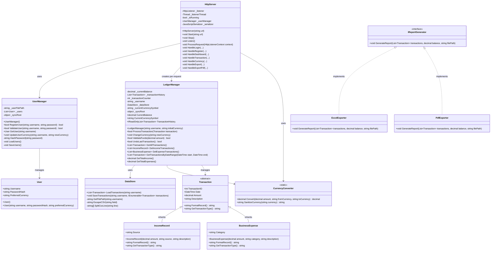

# OmniLedger

## Project Description and Purpose

OmniLedger is a modern, offline financial ledger management system designed to provide a secure and straightforward way for users to track their personal or business finances. The purpose of this project is to create a multi-profile environment where individuals can seamlessly log their income and expenses, review their current financial standing through an interactive dashboard, and automatically manage multiple global currencies. It features a sleek **Dark Mode UI** built with React 19 + Vite and a robust **C# .NET REST API** backend to ensure financial tracking is both beautiful and reliable.

---

## Architecture Overview

OmniLedger follows a decoupled **client-server** architecture:

| Layer | Technology | Description |
|-------|-----------|-------------|
| **Frontend** | React 19 + Vite 8 | Single-page application with component-based UI |
| **Backend** | C# .NET Framework 4.7.2 | Headless REST API server using `System.Net.HttpListener`, runs locally on Windows |
| **Data** | CSV flat-files | Per-user transaction ledgers (`{username}_ledger.csv`) and profile storage (`users.txt`) |
| **API Bridge** | `utils/api.js` | `apiFetch` helper that centralises all HTTP calls to the backend |

### API Endpoints

| Method | Route | Purpose |
|--------|-------|---------|
| `POST` | `/api/auth/login` | Authenticate a user (SHA256 password validation) |
| `POST` | `/api/auth/register` | Create a new user account |
| `GET` | `/api/ledger/dashboard?username=` | Fetch balance, currency, total income/expenses, and full transaction history |
| `POST` | `/api/ledger/transaction` | Add an income or expense (with optional multi-currency auto-conversion) |
| `POST` | `/api/ledger/currency` | Change the user's preferred currency and convert all existing records in-place |
| `GET` | `/api/ledger/export?username=` | Download the full transaction ledger as a CSV file |
| `GET` | `/api/ledger/export-pdf?username=` | Generate and download the full transaction ledger as a PDF report |

---

## UML Diagram

> The following Mermaid diagram reflects the **current** class structure of the C# backend.



---

## Features and Functionalities

- **Multi-Profile Authentication:** Secure Login and Sign Up system utilizing SHA256 password hashing. Every user has a strictly separate profile and ledger file.
- **Modern Dark Mode UI:** A custom React-based interface featuring glassmorphism effects, smooth animations, and a premium branded splash screen.
- **Interactive Dashboard:**
  - **Summary Cards** displaying Total Balance, Total Expenses, and Total Income formatted to 2 decimal places.
  - **History Table** with a Date column, sortable by Latest/Oldest, and paginated at 6 transactions per page with clickable page numbers.
  - **Dual-Axis Tracker Chart** showing Income (green bars, upward) and Expenses (red bars, downward) with interactive hover tooltips displaying per-period financial totals.
  - **Time Navigation** with Year, Month, and Day (7-day weekly) view toggles, plus `<` / `>` slider arrows to browse through historical periods.
- **Multi-Currency Transaction Input:** When adding Income or Expenses, users can select any supported currency from a dropdown. The backend automatically converts the amount into the user's preferred display currency before saving.
- **Smart Currency Conversion:** Includes a dynamic offline currency converter supporting USD ($), EUR (€), GBP (£), JPY (¥), PHP (₱), and INR (₹). Changing the dashboard currency converts all existing transactions in real time.
- **Persistent Data Storage:** Income and Expense transactions are automatically saved locally into user-specific CSV files (`{username}_ledger.csv`) with ISO 8601 timestamps, preventing data loss between sessions.
- **Data Exporting:** The **Export Report** sidebar button opens a format dropdown, allowing users to download the full transaction ledger as either a **CSV** file (spreadsheet-compatible) or a **PDF** report (formatted with a summary, transaction table, and final balance). Both formats are generated by the backend and downloaded directly in the browser.
- **Thread Safety:** All financial operations and user management operations use `lock` synchronization to prevent data corruption during concurrent API calls.

---

## How the Program Works

1. **Startup:** The C# backend launches an `HttpServer` listening on `http://localhost:8080/`. The React frontend is served separately via the Vite development server on `http://localhost:5173/`.
2. **Authentication:** The user is presented with a branded splash screen (2.5-second auto-dismiss). The Auth modal then appears where they can Register or Login. Credentials are validated by `UserManager`, which reads from `users.txt` using SHA256-hashed passwords.
3. **Dashboard Loading:** Once authenticated, the frontend calls `GET /api/ledger/dashboard?username=` via the `apiFetch` helper. The dashboard renders summary cards, a paginated history table, and the dual-axis tracker chart.
4. **Transaction Processing:** When the user clicks **+ Income** or **- Expense**, a `TransactionModal` opens with a currency dropdown (defaulting to their preferred currency). The frontend sends `POST /api/ledger/transaction`. The backend auto-converts the amount via `CurrencyConverter` if the input currency differs from the user's preference, then `LedgerManager` validates funds (expenses only), processes, and persists the transaction via `DataStore`.
5. **Currency Switching:** The **Change Currency** sidebar button opens the `CurrencyModal`. Selecting a new currency triggers `POST /api/ledger/currency`, which converts every historical transaction in-place and updates the user's profile preference via `UserManager.UpdateUserCurrency()`.
6. **Data Export:** The **Export Report** sidebar button reveals a dropdown with two options. Selecting **Export as CSV** calls `GET /api/ledger/export?username=` to download the raw ledger CSV. Selecting **Export as PDF** calls `GET /api/ledger/export-pdf?username=`, which loads all transactions via `LedgerManager`, passes them to `PdfExporter` (via the `IReportGenerator` interface), generates a standards-compliant PDF 1.4 document in a temp file, streams it to the browser as a download, and cleans up the temp file.

---

## Instructions on How to Run the Application

### Prerequisites
- **Windows** Operating System (required for the C# backend)
- **.NET Framework 4.7.2** (or newer) installed
- **Node.js** (v18 or newer) and **npm** installed — [Download Node.js](https://nodejs.org/)

### Step 1: Start the Backend (C# API Server)

#### Option A: Run from pre-built binary
1. Navigate to `OmniLedger\bin\Debug\`.
2. Run `OmniLedger.exe` from a terminal or double-click it.
3. You should see: `Server started on http://localhost:8080/`

#### Option B: Build from source
1. Open a terminal in the root `OmniLedger` directory.
2. Run:
   ```
   dotnet build OmniLedger/OmniLedger.csproj
   ```
3. Then run the compiled executable:
   ```
   OmniLedger\bin\Debug\OmniLedger.exe
   ```

### Step 2: Start the Frontend (React Dev Server)
1. Open a **new** terminal window.
2. Navigate to the `omniledger-ui` directory:
   ```
   cd omniledger-ui
   ```
3. Install dependencies (first time only):
   ```
   npm install
   ```
4. Start the development server:
   ```
   npm run dev
   ```
5. The terminal will display: `Local: http://localhost:5173/`

### Step 3: Open the App
1. Open your browser and navigate to **http://localhost:5173/**.
2. Wait for the splash screen to dismiss (~2.5 seconds).
3. Register a new account or log in with existing credentials.
4. You're in! Start tracking your finances.

> **Important:** Both the C# backend and the React dev server must be running simultaneously for the application to function.

---

## Project Structure

```
OmniLedger/
├── OmniLedger/                  # C# Backend (.NET Framework 4.7.2)
│   ├── Logic/
│   │   ├── HttpServer.cs        # REST API controller & routing (CORS, dispatch)
│   │   ├── LedgerManager.cs     # Thread-safe financial operations (lock-based)
│   │   ├── UserManager.cs       # User auth, SHA256 hashing, currency preference
│   │   ├── DataStore.cs         # CSV persistence (load/save transactions)
│   │   ├── CurrencyConverter.cs # Offline exchange rate conversion & sanitization
│   │   ├── Transaction.cs       # Abstract base transaction model
│   │   ├── Income.cs            # IncomeRecord subclass (Source field)
│   │   ├── Expense.cs           # BusinessExpense subclass (Category field)
│   │   ├── User.cs              # User profile model (Username, PasswordHash, PreferredCurrency)
│   │   ├── IReportGenerator.cs  # Report generation interface (Abstraction)
│   │   ├── ExcelExporter.cs     # CSV export implementation (Polymorphism)
│   │   └── PdfExporter.cs       # PDF export implementation (Polymorphism)
│   ├── Program.cs               # Entry point (instantiates & starts HttpServer)
│   └── OmniLedger.csproj        # Project configuration (.NET Framework 4.7.2)
│
├── omniledger-ui/               # React 19 + Vite 8 Frontend
│   ├── src/
│   │   ├── components/
│   │   │   ├── SplashScreen.jsx      # Animated branded landing page
│   │   │   ├── SplashScreen.css
│   │   │   ├── AuthModal.jsx         # Login / Sign Up modal
│   │   │   ├── AuthModal.css
│   │   │   ├── Dashboard.jsx         # Main dashboard (charts, history, cards)
│   │   │   ├── Dashboard.css
│   │   │   ├── TransactionModal.jsx  # Income/Expense input with currency select
│   │   │   ├── TransactionModal.css
│   │   │   ├── CurrencyModal.jsx     # Currency switcher modal
│   │   │   └── CurrencyModal.css
│   │   ├── utils/
│   │   │   └── api.js           # apiFetch helper centralising all backend calls
│   │   ├── App.jsx              # Root component & app-level state (auth, splash)
│   │   ├── App.css
│   │   ├── index.css            # Global CSS design tokens & resets
│   │   └── main.jsx             # React 19 entry point
│   ├── public/
│   ├── vite.config.js           # Vite build configuration
│   └── package.json             # Dependencies (React 19, Vite 8)
│
├── BUILD_SUMMARY.md             # OOP principles & build reference
├── .gitignore
└── README.md
```

---

## OOP Principles Demonstrated

| Principle | Implementation | Key Files |
|-----------|----------------|-----------|
| **Encapsulation** | Private `_currentBalance` & `_transactionHistory` in `LedgerManager`; only exposed via read-only properties and validated methods | `Transaction.cs`, `LedgerManager.cs` |
| **Inheritance** | `IncomeRecord` and `BusinessExpense` extend abstract `Transaction` | `Income.cs`, `Expense.cs`, `Transaction.cs` |
| **Polymorphism** | `FormatRecord()` and `GetTransactionType()` overridden per subclass; `IReportGenerator` fulfilled by two exporters | `IReportGenerator.cs`, `ExcelExporter.cs`, `PdfExporter.cs` |
| **Abstraction** | `IReportGenerator` interface decouples export format from business logic | `IReportGenerator.cs` |
| **Thread Safety** | `lock (_syncRoot)` in `LedgerManager` and `UserManager` guard all write operations | `LedgerManager.cs`, `UserManager.cs` |

---

## Development Team

- **Luke Andre V. Paala** - Project Head/Leader
- **Amber Loveine Dadap** - UI/UX Designer
- **Hans Gadiel P. Caraig** - Logic Tester
